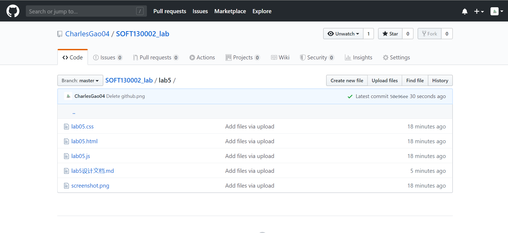
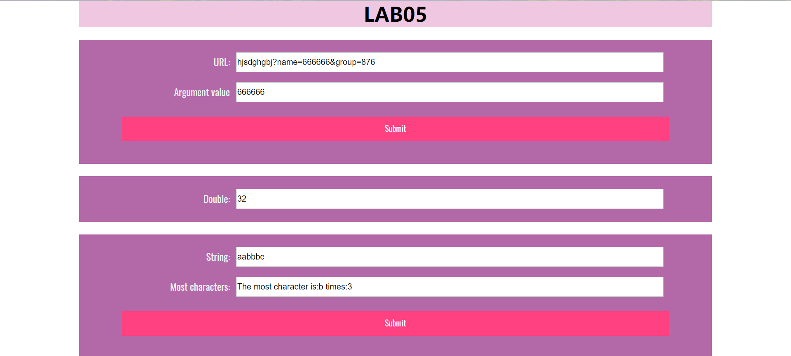

##### lab5设计文档

#### 17300290033高祥兴

#### 具体完成情况

##### 1. showWindowHref()

对url读取以后不断进行字符串的split切割，先将“？”前面部分去掉，再将后面部分根据“&”切割，其中再根据“=”切割，如果“=”左边是name，则url_result.value为“=”右边的内容，如果不存在，最终url_result.value显示为No name value!

##### 2. timeTest()

用html里的addEventListener来触发，在timeTest()函数内部通过setInterval()函数进行一定时间（即5s）后的重复执行，当分钟数变化或者次数达到10次时，通过clearInterval跳出

##### 3. arrSameStr()

用一个dict来统计各个字符出现的次数，最后遍历，找到出现次数最大的字符，并把字符和最大次数赋给result.value

#### Github截图

#### 网页效果截图

